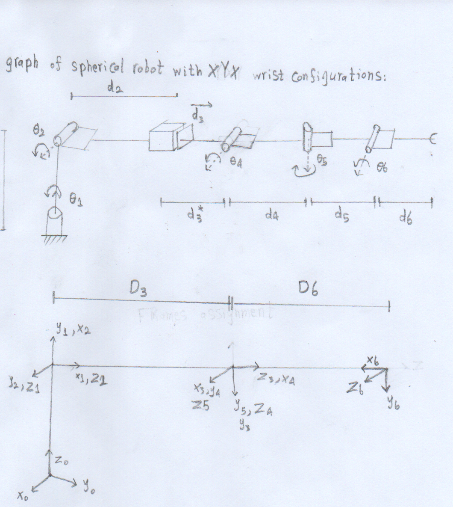

# Kinematics and Dynamics for 3DOF Spherical robot with attached XYX wrist configuration
 
Spherical robot is a 3 DOF robot with configuration of RRP. In this project, a spherical wrist is attached with YXY configurations for better position and orientation control of the end effector.

This project contains the matlab implementation for caluclating:
* Forward & Inverse kinematics
* Differential  kinematics
* Trajectory Planning
* Manipulator Dynamics

The project is divided into 4 main tasks, each performs a certian function, to organize the code and for easier debugging.
## Methodology
### Forward & Inverse kinematics
The forward kinematics is implemented using DH parameters and the inverse kinematics utilize the pieper's solution.

<p align="center"></p>

The DH parameters along with kinematics results are presented in `Task_1/Task1_Report.pdf`

### Differential  kinematics
The jacobian depends on the number of robot joints. It it is a m×n matrix where m represents space dimension of end effector and n represents the number of joints. Two differnet formulas are used for revolute and prismatic joints. Also, singularity occures (determinant of jcobian is zero) with this model in three different cases:

1. Robot is fully extended
2. End effector on first joint axis
3. Axis 4,6 are collinear

For example, the code will generate `This is a singularity!` message when the robot is fully extended when second joint equals 90 degrees as shown below
<p align="center"></p>

More details about Jacobian matrix derivation can be found in `Task_2/Task2_Report.pdf`

### Trajectory Planning
Given specific points that joints should follow, the position, velocity, and acceleration trajectories  are plotted for each joint. Numerical control and synchronization between all robot joints were implemented as well, as shown below.

<p align="center"></p>

More details about Trajectory Planning, synchronization, Numerical control, Propagated error, Junction can be found in `Task_3/Task3_Report.pdf`.


### Dynamics
In this part, the dynamics of the robot is desribed by second order differntial equation as follows:
$$M(q) \ddot q + C(q,\dot q) \dot q + g(q) = \tau$$
Where $M(q), C(q,\dot q), g(q)$  are mass matrix, Corriolis matrix, Gravity Matrix respectively. The full derivation for these three matrices can be found in `Task_4/Task4_Report.pdf`.

## Folder Structure
The project code is divided into four main tasks as follows:
```
└── Task_1
       ├── FK.m                 <-- forward kinematics
       ├── IK.m                 <-- inverse kinematics
       └── FK_IK_Symbolic.m     <-- symbolic representation for IK and FK
├── Task_2
       ├── FK_with_jacobian.m   <-- jacobian matrix calculation
├── Task_3
       ├── plan_trajectory.m    <-- plot trajectory graphs
       ├── junction.m           <-- performs joint junction
       ├── trajectory_time.m    <-- calculates time needed for trajectory planning
       ├── FK.m                 <-- forward kinematics function needed for propagated error
       └── Trajectory_Planning.m    <-- perform synchronization and numerical control 
├── Task_4    
       ├── Dynamics_Symbolic.m  <-- symbolic representation for dynamics equation
       └── Dynamics.m   <-- robot dynamics
└── DNRS_Project_Presentation.pdf  <-- breif summary for the whole project 
```
## Matlab version
This project was coded using matlab 2020a so it is highly recommended to run this project with the same version or later ones as some matlab versions can not run .m files from later versions.
## Disclaimer
This project was part of *Dynamics of Non-Linear Systems* course (Fall 2021) by Prof. Alexander Klimchik.